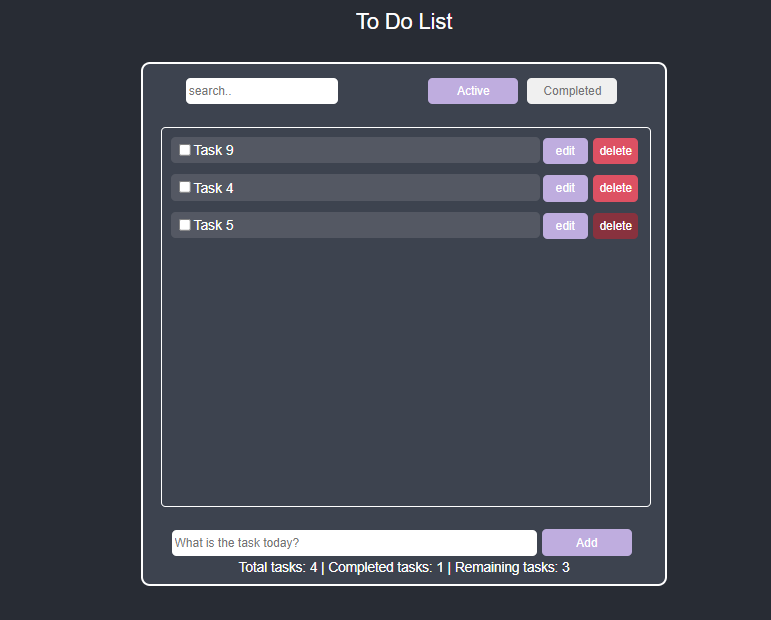
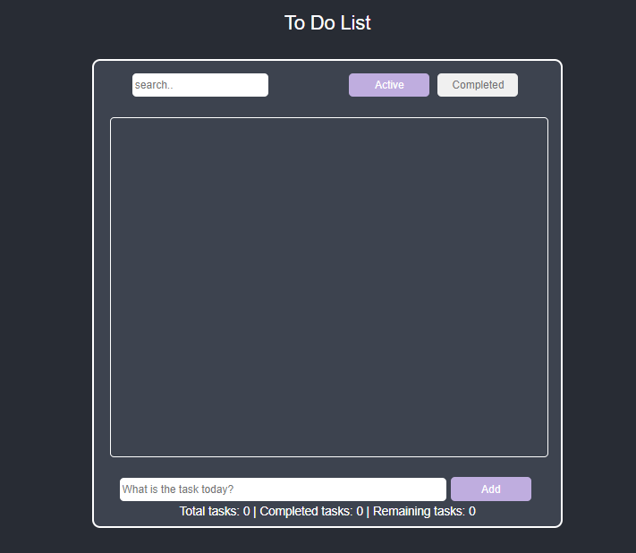

## Basic TODO App
##### Make a basic TODO App where the user can:
     See existing todos.
     Add a new todo to the list.
     Search through the todos.
     Mark todo as done.
     A toggle to show/hide todos.
     Count of total todos and how many are done and remaining in the list footer.

##### Result

